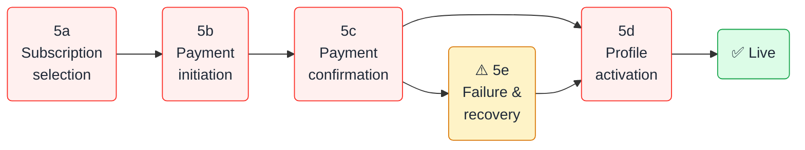

<Note>
  **Internal use only.** This documentation is for Exotic staff across all departments. Do not share directly with escorts or clients.
</Note>

## What this is and why it exists

No one can effectively sell, support, market, or improve a product they don't fully understand. The Exotic Online University gives every team member — Sales, CS, Finance, RD Team, SEO, and IT Infrastructure — a shared, accurate view of how the platform works from the **escort's perspective**.

Every stage is documented with real system behaviour, department-specific guidance, SOPs, troubleshooting, and certification questions.

---

## Scope — 54 African markets

Exotic Online is a **pan-African platform**. Our mission is to serve adult advertising markets across all 54 African nations. Kenya is the launch and reference market used throughout this documentation — but every process described here applies to every market.

<Tip>
  When you read "KES" → substitute your market's currency. When you read "M-Pesa" → substitute the dominant mobile money provider (MTN MoMo for West Africa, Airtel Money for East/Central Africa, and others by region).
</Tip>

---

## The escort journey — 8 stages

The complete lifecycle from first contact to repeat subscriber.

<CardGroup cols={3}>
  <Card title="1 — Discover" icon="magnifying-glass" href="/product/stage-1-discover">
    Escort learns about Exotic via referral, outbound sales call, or organic Google search
  </Card>
  <Card title="2 — Register" icon="user-plus" href="/product/stage-2-register">
    Account created on the WordPress site; Lead converts to Client in the CRM
  </Card>
  <Card title="3 — Profile setup" icon="camera" href="/product/stage-3-media">
    Bio, rates, city, and up to 20 photos uploaded — completeness drives performance
  </Card>
  <Card title="4 — Verification" icon="shield-check" href="/product/stage-4-verification">
    Staff verify identity and age via WhatsApp; CRM verified flag set — mandatory
  </Card>
  <Card title="5 — Subscription & Payment" icon="credit-card" href="/product/stage-5a-subscription-selection">
    Escort selects a package, pays via mobile money or hosted checkout, profile goes live
  </Card>
  <Card title="6 — Customer contact" icon="message" href="/product/stage-6-contact">
    Visitors contact the escort via WhatsApp, phone, Viber, or Exotic Chat (coming soon)
  </Card>
  <Card title="7 — Renewal" icon="rotate-right" href="/product/stage-7-renewal">
    CRM sends renewal reminders; agent calls; escort repurchases to stay live
  </Card>
  <Card title="8 — Upgrades" icon="circle-arrow-up" href="/product/stage-8-upgrades">
    Escort moves to a higher-visibility package tier via agent-assisted deal update
  </Card>
</CardGroup>

---

## Stage 5 — Payment in detail

Stage 5 is the most technically complex and the source of most customer support tickets. It has its own sub-stages:

---

## Who is the customer?

<CardGroup cols={2}>
  <Card title="Primary goal" icon="bullseye">
    Get profile visible to clients, generate contact enquiries, and earn income from their listing
  </Card>
  <Card title="Primary worry" icon="circle-question">
    "Is my profile live? Am I getting contacts? Was my payment confirmed?"
  </Card>
  <Card title="Tech comfort level" icon="mobile-screen-button">
    Comfortable with smartphones and mobile money — less familiar with web dashboards and CRM tools
  </Card>
  <Card title="Payment preference" icon="wallet">
    Mobile money first (M-Pesa, MTN MoMo, Airtel Money by market) — card via hosted checkout as secondary
  </Card>
</CardGroup>

---

## Package tiers

All tiers are defined and priced by the **RD Team** per market. Sales staff do not modify pricing.

| Tier | Position in search | Target escort |
|---|---|---|
| **VVIP** | Highest | Top-earning escorts wanting maximum exposure |
| **VIP** | Very high | High-volume escorts |
| **Premium** | High | Established escorts wanting more clients |
| **Featured** | Above Basic | Escorts wanting better visibility |
| **Basic** | Standard | New escorts testing the platform |

<Warning>
  Package tiers, features, and pricing are **owned by the RD Team**. If an escort asks you to change a price, create a new tier, or grant a discount beyond the approved threshold — escalate to your manager. Do not contact IT Infrastructure for pricing changes.
</Warning>

---

## Department responsibilities at a glance

<AccordionGroup>
  <Accordion title="Sales & CS — what you own" icon="headset">
    | Stage | Responsibility |
    |---|---|
    | Discover | Outbound calls, referral tracking, lead qualification |
    | Register | Guide registration, deliver credentials, handle failed signups |
    | Profile setup | Coach bio quality, completeness check before subscription |
    | Verification | **Full ownership** — WhatsApp ID collection, age check, CRM toggle |
    | Payment | Retry failed STK Push, send payment links, troubleshoot F2/F3 |
    | Activation | Confirm profile is live; handle "I paid but profile isn't live" |
    | Renewal | **Full ownership** — campaigns, calls, objection handling, close |
    | Upgrades | Pitch, process, and confirm upgrades |
  </Accordion>

  <Accordion title="Finance — what you own" icon="calculator">
    | Stage | Responsibility |
    |---|---|
    | Payment confirmation | **Full ownership** — daily reconciliation, manual review queue, reversals |
    | Settlement review | Approve/reject amount-mismatch payments (±5% tolerance) |
    | Client resolution | Match payments to clients when auto-match fails |
    | Renewal revenue | Track renewal MRR; separate trial vs. paid activations |
    | Discounts | Review all deals with `discount_percentage > 0`; flag unapproved discounts |
  </Accordion>

  <Accordion title="RD Team — what you own" icon="lightbulb">
    | Area | Responsibility |
    |---|---|
    | Package tiers | Define tier features, names, and search position logic |
    | Pricing | Set and update `ProductPrice` records per market |
    | Market expansion | Decide which African countries to launch in and when |
    | Verification policy | Set ID types accepted, age threshold, re-verification rules |
    | Exotic Chat | Product roadmap and launch timeline for native messaging app |
    | Contact channels | Add, remove, or change contact channel types on profiles |
  </Accordion>

  <Accordion title="SEO & IT Infrastructure — what you own" icon="server">
    | Area | Responsibility |
    |---|---|
    | SEO | Organic search ranking, landing page quality, profile SEO signals |
    | Payment infrastructure | Webhook health, provider routing, `BillingMarketProviderBinding` config |
    | WordPress sync | `WpSyncService` health, activation endpoint, plugin maintenance |
    | Failure recovery | F1, F4, F5, F6, F10 failure modes — escalate from CS |
    | Monitoring | `laravel.log`, webhook delivery dashboard, scheduled tasks |
  </Accordion>
</AccordionGroup>

---

## Start your learning path

Choose the path that matches your role:

<CardGroup cols={2}>
  <Card title="Sales & CS agents" icon="headset" href="/product/stage-1-discover">
    Start at Stage 1 — Discover. Follow the journey in order. Pay special attention to Stages 4 (Verification), 5e (Failures), and 7 (Renewal).
  </Card>
  <Card title="Finance team" icon="calculator" href="/product/stage-5c-payment-confirmation">
    Start at Stage 5c — Payment confirmation. Then read 5e — Failures, then Stage 7 — Renewal for revenue context.
  </Card>
  <Card title="RD Team" icon="lightbulb" href="/product/stage-5a-subscription-selection">
    Start at Stage 5a — Subscription selection to understand the customer checkout experience, then Stage 6 — Contact for the Exotic Chat context.
  </Card>
  <Card title="SEO & IT Infrastructure" icon="server" href="/product/stage-5b-payment-initiation">
    Start at Stage 5b — Payment initiation. Then 5c, 5d, and 5e. These cover the systems you own.
  </Card>
</CardGroup>

---

<Card title="Ready to get certified? →" icon="graduation-cap" href="/product/certification">
  Take the 20-question quiz and earn your Exotic Online University certificate. Pass mark: 80%.
</Card>
