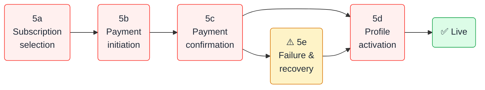

<Note>
  **Internal use only.** This documentation is for Exotic staff across all departments. Do not share directly with escorts or clients.
</Note>

## What this is and why it exists

No one can effectively sell, support, market, or improve a product they don't fully understand. The Exotic Online University gives every team member — Sales & CS, Finance, R&D/Product, IT Infrastructure, and SEO & Marketing — a shared, accurate view of how the platform works from the **escort's perspective**.

Every stage is documented with real system behaviour, department-specific guidance, SOPs, troubleshooting, and certification questions.

---

## Scope — 54 African markets

Exotic Online is a **pan-African platform**. Our mission is to serve adult advertising markets across all 54 African nations. Kenya is the launch and reference market used throughout this documentation — but every process described here applies to every market.

<Tip>
  When you read "KES" → substitute your market's currency. When you read "M-Pesa" → substitute the dominant mobile money provider (MTN MoMo for West Africa, Airtel Money for East/Central Africa, and others by region).
</Tip>

---

## The escort journey — 8 stages

The complete lifecycle from first contact to repeat subscriber.

<CardGroup cols={3}>
  <Card title="1 — Discover" icon="magnifying-glass" href="/product/stage-1-discover">
    Escort learns about Exotic via referral, outbound sales call, or organic Google search
  </Card>

  <Card title="2 — Register" icon="user-plus" href="/product/stage-2-register">
    Account created on the WordPress site; Lead converts to Client in the CRM
  </Card>

  <Card title="3 — Profile setup" icon="camera" href="/product/stage-3-media">
    Bio, rates, city, and up to 20 photos uploaded — completeness drives performance
  </Card>

  <Card title="4 — Verification" icon="shield-check" href="/product/stage-4-verification">
    Staff verify identity and age via WhatsApp; CRM verified flag set — mandatory
  </Card>

  <Card title="5 — Subscription & Payment" icon="credit-card" href="/product/stage-5a-subscription-selection">
    Escort selects a package, pays via mobile money or hosted checkout, profile goes live
  </Card>

  <Card title="6 — Customer contact" icon="message" href="/product/stage-6-contact">
    Visitors contact the escort via WhatsApp, phone, SMS, or Viber; Exotic Chat will support ongoing Exotic-to-escort communication
  </Card>

  <Card title="7 — Renewal" icon="rotate-right" href="/product/stage-7-renewal">
    CRM sends renewal reminders; agent calls; escort repurchases to stay live
  </Card>

  <Card title="8 — Upgrades" icon="circle-arrow-up" href="/product/stage-8-upgrades">
    Escort moves to a higher-visibility package tier via agent-assisted deal update
  </Card>
</CardGroup>

---

## Stage 5 — Payment in detail

Stage 5 is the most technically complex and the source of most customer support tickets. It has its own sub-stages:

---

## Who is the customer?

<CardGroup cols={2}>
  <Card title="Primary goal" icon="bullseye">
    Get profile visible to clients, generate contact enquiries, and earn income from their listing
  </Card>

  <Card title="Primary worry" icon="circle-question">
    "Is my profile live? Am I getting contacts? Was my payment confirmed?"
  </Card>

  <Card title="Tech comfort level" icon="mobile-screen-button">
    Comfortable with smartphones and mobile money — less familiar with web dashboards and CRM tools
  </Card>

  <Card title="Payment preference" icon="wallet">
    Mobile money first (M-Pesa, MTN MoMo, Airtel Money by market) — card via hosted checkout as secondary
  </Card>
</CardGroup>

---

## Package tiers

Package tiers are proposed and managed by the **CS head for each market or region**, then approved by the **Head of CS/Sales** before any technical change is applied in the system.

| Tier | Position in search | Target escort |
| --- | --- | --- |
| **VVIP** | Highest | Top-earning escorts wanting maximum exposure |
| **VIP** | Very high | High-volume escorts |
| **Premium** | High | Established escorts wanting more clients |
| **Featured** | Above Basic | Escorts wanting better visibility |
| **Basic** | Standard | New escorts testing the platform |

<Warning>
  Package tiers, features, and pricing are owned by the **CS head for each market or region** and must be approved by the **Head of CS/Sales**. If an escort asks you to change a price, create a new tier, or grant a discount beyond the approved threshold, escalate through Sales & CS leadership. Technical teams apply approved changes in the system, but they do not own the decision.
</Warning>

---

## Department responsibilities at a glance

<AccordionGroup>
  <Accordion title="Sales & CS — what you own" icon="headset">
    | Stage | Responsibility |
    | --- | --- |
    | Discover | Outbound calls, referral tracking, lead qualification |
    | Register | Guide registration, deliver credentials, handle failed signups |
    | Profile setup | Coach bio quality, completeness check before subscription |
    | Verification | **Full ownership** — WhatsApp ID collection, age check, CRM toggle |
    | Payment | Retry failed STK Push, send payment links, collect receipts, and handle first-line payment recovery |
    | Payment confirmation | Daily receipt confirmation, payment matching follow-up, and activation coordination through market leads / Head of Markets |
    | Activation | Confirm profile is live; handle "I paid but profile isn't live" and log the outcome |
    | Renewal | **Full ownership** — campaigns, calls, objection handling, close |
    | Upgrades | Pitch, process, and confirm upgrades |
  </Accordion>

  <Accordion title="Finance — what you own" icon="calculator">
    | Stage | Responsibility |
    | --- | --- |
    | Payment confirmation | Weekly reconciliation, payment exception review, and reversals |
    | Settlement review | Approve/reject amount-mismatch payments (±5% tolerance) |
    | Disputes | Review unclear receipts, disputed payments, and suspicious mismatches escalated from market operations |
    | Renewal revenue | Track renewal MRR |
    | Revenue controls | Track reversals, mismatch trends, and other payment exceptions surfaced through weekly reconciliation |
  </Accordion>

  <Accordion title="R&D/Product — what you own" icon="lightbulb">
    | Area | Responsibility |
    |---|---|
    | Verification policy | Set ID types accepted, age threshold, re-verification rules |
    | Exotic Chat | Product roadmap for Exotic-to-escort communication, plus rollout planning and technical delivery |
    | Contact channels | Add, remove, or change public contact channel types on profiles |
    | Payment workflow logic | Provider routing rules, webhooks, callback validation, `BillingMarketProviderBinding` product config, and market-level fallback provider planning |
    | CRM/WordPress sync logic | `WpSyncService` behavior, broken CRM/profile links, activation workflow, and provisioning recovery logic |
    | Product reporting definitions | Discovery, checkout, and contact event requirements used by reporting and analytics |
  </Accordion>

  <Accordion title="IT Infrastructure — what you own" icon="server">
    | Area | Responsibility |
    |---|---|
    | WordPress environment | Admin configuration, plugin deployment, application passwords, and site access |
    | Infrastructure | Server uptime, network access, environment health, and browser/device blocking issues |
    | Tracking implementation | Google Analytics tag deployment, tracker loading, and environment-level instrumentation support |
    | Technical monitoring | Scheduler health, connection tests, outage recovery, and environment diagnostics |
  </Accordion>

  <Accordion title="Commercial leadership — what you own" icon="briefcase">
    | Area | Responsibility |
    |---|---|
    | Package tiers | CS head for each market or region defines tier structure based on market performance |
    | Pricing | CS head for each market or region proposes pricing; Head of CS/Sales approves |
    | Discount policy | Sales & CS leadership define discount guardrails and approval thresholds |
    | Market expansion input | Sales, RD, and market research provide the CEO with launch recommendations |
    | Market expansion decision | CEO decides which African countries to launch in and when |
  </Accordion>

  <Accordion title="SEO & Marketing — what you own" icon="chart-line">
    | Area | Responsibility |
    |---|---|
    | SEO | Organic search ranking, landing page quality, and profile SEO signals |
    | Marketing | Campaign messaging, market-facing positioning, and conversion support content |
    | Analytics reporting | Google Analytics traffic, landing-page conversion, and funnel reporting |
    | Search health | Indexation checks, Google update monitoring, PageSpeed review, and recovery planning after traffic drops |
    | Performance monitoring | Flag drop-offs in registrations, payments, and contact engagement back to Sales & CS, R&D/Product, or IT Infrastructure depending on the issue |
  </Accordion>
</AccordionGroup>

---

## Start your learning path

Choose the path that matches your role:

<CardGroup cols={2}>
  <Card title="Sales & CS agents" icon="headset" href="/product/stage-1-discover">
    Start at Stage 1 — Discover. Follow the journey in order. Pay special attention to Stages 4 (Verification), 5e (Failures), and 7 (Renewal).
  </Card>

  <Card title="Finance team" icon="calculator" href="/product/stage-5c-payment-confirmation">
    Start at Stage 5c — Payment confirmation. Then read 5e — Failures, then Stage 7 — Renewal for revenue context.
  </Card>
  <Card title="R&D/Product" icon="lightbulb" href="/product/stage-5a-subscription-selection">
    Start at Stage 5a — Subscription selection, then 5b, 5c, 5d, and 5e to understand payment workflow logic, callbacks, activation, and failure recovery.
  </Card>
  <Card title="IT Infrastructure" icon="server" href="/product/stage-5d-profile-activation">
    Start at Stage 5d — Profile activation, then 5b, 5c, and 5e to understand WordPress environment health, tracking implementation, and outage recovery.
  </Card>
  <Card title="SEO & Marketing" icon="chart-line" href="/product/stage-1-discover">
    Start at Stage 1 — Discover, then Stages 3 and 6 to understand SEO signals, organic conversion, contact behaviour, and analytics reporting.
  </Card>
</CardGroup>

---

<Card title="Ready to get certified? →" icon="graduation-cap" href="/product/certification">
  Take the 20-question quiz and earn your Exotic Online University certificate. Pass mark: 80%.
</Card>
